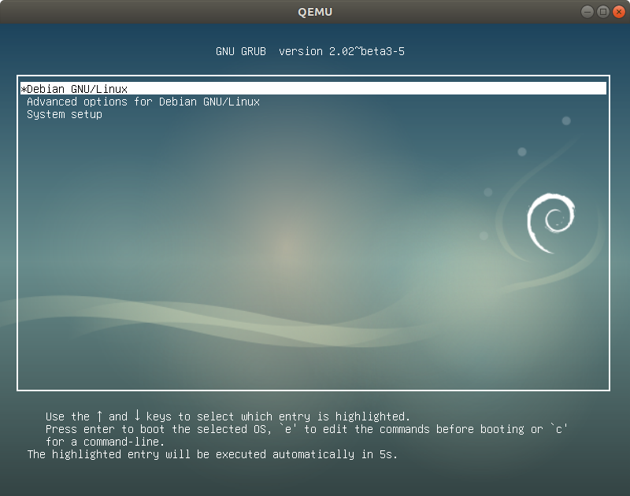

# yabits: Fast and lightweight yet another UEFI implementation

[yabits](https://github.com/yabits/uefi) is a pure UEFI coreboot payload.
Compared with [TianoCore](https://www.tianocore.org/),
it is fast and lightweight.
yabits is based on the part of [Minoca OS](https://www.minocacorp.com/).
It can run GRUB2, Linux, OpenBSD, and other UEFI applications.
Tested on QEMU/KVM and Lenovo ThinkPad X230.
It is still under the development and not ready for production.

## Downloads

The latest yabits is [v0.0.1](https://github.com/yabits/uefi/releases/tag/v0.0.1).
This release is pre-release.
* `coreboot.com`: coreboot rom with yabits for `qemu-system-x86_64` machine type "pc-i440fx-2.8"
* `uefi`: yabits coreboot payload with debug infomation
* `uefi.elf`: stripped yabits coreboot payload

You can try yabits `coreboot.com` on QEMU.
Prepare UEFI-aware OS image.
Run

```
$ qemu-system-x86_64 -drive if=pflash,format=raw,readonly,file=coreboot.rom -drive file=os.qcow2,if=none,id=sata -device ich9-ahci,id=ahci -device ide-drive,drive=sata,bus=ahci.0 -serial stdio -m 2G
```



## Build from Source

### Step1 - Follow coreboot build instruction [coreboot lesson 1 - Starting from scratch](https://doc.coreboot.org/lessons/lesson1.html)

### Step2 - Clone yabits repository

```
$ git clone https://github.com/yabits/uefi.git
$ cd uefi
```

### Step3 - Configure settings

```
$ make menuconfig
```

### Step4 - Build yabits payload

```
$ make
```

### Step5 - Configure coreboot

```
$ cd coreboot
$ make menuconfig
    select your favorite mainboard
    select 'Payload' menu
    select 'Add a Payload'
    select 'Payload path and filename'
    select 'uefi/build/build/uefi.elf'
    save config and exit
$ make
```

## Demo

OpenBSD runs with yabits

[](https://www.youtube.com/watch?v=2jjS4zQgUxQ)

Boot time comparison on Lenovo ThinkPad X230. yabits vs default UEFI

[](https://www.youtube.com/watch?v=1OTUr2_W5r4)

## Comparison

### Boot time and footprint

|           | Boot time (s) | Footprint (MiB) |
| --------- | ------------- | --------------- |
| yabits    | 3.15          | 0.4             |
| TianoCore | 7.15          | 4.1             |

### Other UEFI implementations

|           | Boot time  | Footprint | Open source | TianoCore free |
| --------- | ---------- | --------- | ----------- | -------------- |
| yabits    | ✔️          | ✔️         | ✔️           | ✔️              |
| default   | ✖️          | ✖️         | ✖️           | ✖️              |
| TianoCore | ✖️          | ✖️         | ✔️           | ✖️              |
| NERF      | ✔️          | ✔️         | ✔️           | ✔️              |

## License

yabits is lincesed under the terms of 
[GNU General Public Lincese, version 3](https://github.com/yabits/uefi/blob/master/LICENSE).
See the headers of source code for more details.

This page is 
[MIT](https://github.com/yabits/yabits.github.io/blob/master/LICENSE) 
license.
